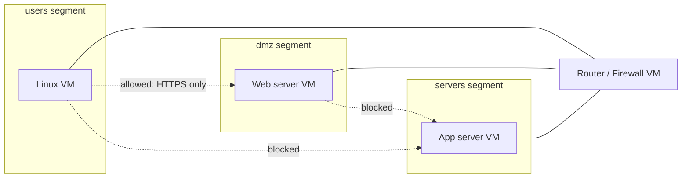

# Day 01 — Home Lab with Segmented Network

> **One-line hook:** I built an isolated, multi-segment virtual network and wrote a tool that proves the isolation actually works — not just that it "should".

`Level: 🟢 Beginner` · `Stack: VirtualBox/Proxmox, pfSense or Linux routing, Python` · `Maps to: NIST CSF PR.AC-5 (network segmentation)`

---

## 1. The Problem

Almost every real-world breach that spreads (ransomware, lateral movement after
a phish) spreads *because* the network was flat — one compromised laptop could
talk to everything else. Segmentation is the single control that turns "one
machine popped" into "one machine popped, contained." Before doing any other
security work, I needed a lab that actually enforces this, so every later
project (SOC, AD attacks, malware analysis) has somewhere safe and realistic
to run.

## 2. What You'll Learn

- Designing a virtual network with isolated segments (VLANs / internal
  networks), not just "a VM on NAT" — **NIST CSF PR.AC-5**
- The difference between *believing* a network is segmented and *proving* it
  with an actual reachability test
- Writing a safe, read-only network testing tool in Python (subprocess
  hygiene, TCP connect checks, YAML-driven config)
- Documenting a deliberate exception to a "deny by default" policy

## 3. Prerequisites & Lab Setup

1. Install [VirtualBox](https://www.virtualbox.org/) (free) — or Proxmox VE if
   you have spare hardware for a more realistic hypervisor setup.
2. In VirtualBox: **File → Host Network Manager**, create two or more internal
   networks (e.g. `intnet-users`, `intnet-servers`, `intnet-dmz`). Internal
   networks are isolated from each other and your host by default — that's
   what makes this safe and realistic.
3. Create a router/firewall VM with one NIC per segment:
   - Easiest: a small Linux VM (Debian/Alpine) with `iptables`/`nftables` doing
     the routing and filtering.
   - More realistic: [pfSense](https://www.pfsense.org/) as the router VM.
4. Create at least one lightweight Linux VM per segment (e.g. Alpine or
   Debian) with a static IP and SSH enabled.
5. Install Python 3.10+ and `pip install -r code/requirements.txt` on each
   segment VM you'll test from.

Nothing in this project needs to run in CI — it's local virtualization work.

## 4. Core Concepts Explained Simply

**Segment** = a network your hypervisor keeps separate at Layer 2/3, the same
idea as a VLAN in a real switch. Think of it like separate rooms in a building
connected only through a reception desk (the router/firewall) that decides who
gets to walk between rooms.

**"Believing" vs "proving" isolation:** it's easy to *configure* two internal
networks and assume they can't talk. It's a different thing to actually stand
on a host in segment A and try to reach a host in segment B — that's the only
way to know your firewall rules do what you think they do. This project's
code does exactly that from the *inside* of each segment, not from an outside
observer.



## 5. Step-by-Step Build

See [walkthrough.md](./walkthrough.md) for exact commands. In short:
1. Build the hypervisor network topology (segments + router VM).
2. Deploy a Linux VM per segment, note their IPs.
3. Copy `code/segmentation_check.py` and a filled-in `segments.local.yaml`
   (from `code/segments.example.yaml`) onto one VM per segment.
4. Run the checker from each segment; collect the reports.
5. Save each run's output into `evidence/`.

## 6. The Code, Explained

[`code/segmentation_check.py`](./code/segmentation_check.py) is a small,
dependency-light Python tool (only PyYAML) that:

- Reads `segments.local.yaml`, which declares which hosts live in which
  segment, and an explicit `allowed_paths` list of the *only* traffic that
  should legally cross a segment boundary.
- Is run once **per segment**, with `--from-segment <name>`, from a host
  physically/virtually inside that segment — because reachability is only
  meaningful from the vantage point actually behind the firewall rule being
  tested. Running it from an unrelated machine (like your laptop) would prove
  nothing about the VLAN boundary.
- For every other segment's hosts, checks: is there a matching
  `allowed_paths` entry? If yes, expect a TCP connect on that port to
  succeed. If no, expect even a plain ICMP ping to fail.
- Prints a PASS/FAIL table and exits with a non-zero status code if reality
  doesn't match the declared policy — so it's ready to be dropped into a cron
  job or CI step later in the series (e.g. Day 41's SOC automation).

`subprocess.run()` is always called with an argument **list**, never a shell
string — that's a deliberate choice so a malformed hostname in the config
can't be interpreted as a shell command (command injection).

## 7. Results & Evidence

Run from the `users` segment VM:

```
$ python segmentation_check.py segments.local.yaml --from-segment users
Running from segment: users
TO         HOST             EXPECTED       ACTUAL         RESULT
------------------------------------------------------------------
dmz        192.168.30.10    reachable:443  reachable:443  PASS
servers    192.168.20.10    blocked        blocked        PASS
------------------------------------------------------------------
2 checks run, 0 violation(s).

All cross-segment traffic from this segment matches the declared policy.
```

See [`evidence/`](./evidence/) for the real run output and packet captures
from my lab (added after I build the VMs — screenshots/pcaps aren't faked
ahead of time).

## 8. Detection / Defense Angle

Segmentation is itself a defense, but it also needs its own monitoring:
- Firewall/router logs should record and alert on **denied cross-segment
  attempts** — a spike often means a compromised host trying to move
  laterally, not a config bug.
- Periodically re-running `segmentation_check.py` (e.g. via cron, or later as
  a CI/SOAR step) catches **configuration drift** — someone loosens a rule
  for a one-off reason and forgets to revert it.

## 9. Upgrade to Stand Out

The stretch goal from the roadmap: capture the traffic during a test run
(Wireshark on the router VM) and include a sanitized `.pcap` in `evidence/`
that visually shows the blocked segment's packets simply never arriving —
pairs well with Day 04 (packet capture analysis).

## 10. Scope & Legal

This project is for authorized, educational testing only, run against my own
lab / public intentionally-vulnerable targets / my own accounts. Do not use
these techniques against systems you do not own or have permission to test.

## 11. References

- [NIST SP 800-207 — Zero Trust Architecture](https://csrc.nist.gov/pubs/sp/800/207/final) (segmentation as a ZTA building block)
- [NIST CSF](https://www.nist.gov/cyberframework) — PR.AC-5 (network integrity / segmentation)
- [pfSense documentation](https://docs.netgate.com/pfsense/en/latest/)
- [VirtualBox networking modes](https://www.virtualbox.org/manual/ch06.html)

## 12. Interview Prep

1. **Q: Why test segmentation from inside each segment instead of from one central scanner?**
   A: Reachability depends on the vantage point relative to the firewall/VLAN
   rule. A scanner outside the rule's path can't tell you whether the rule
   itself works — it can only tell you whether it (the scanner) can reach the
   target, which may say nothing about the actual boundary.

2. **Q: What's the difference between "deny by default" and this script's design?**
   A: The script assumes everything not explicitly listed in `allowed_paths`
   should be blocked — deny-by-default — and treats any host that's reachable
   without an explicit allow entry as a policy violation, not a bonus feature.

3. **Q: Why use both ICMP ping and TCP connect instead of just one?**
   A: ICMP is enough to prove basic network-layer blocking for the "should be
   fully blocked" case. But an *allowed* path needs to be verified at the
   specific port it's supposed to work on — a host could allow ICMP but still
   correctly block the actual service port, or vice versa, so testing the
   real allowed port is the only way to confirm the specific rule.

4. **Q: How would you extend this for a network with 50 segments?**
   A: Keep the same "declare then verify" model but generate `segments.yaml`
   from the actual firewall/router config (source of truth) instead of
   hand-writing it, so the test can never silently drift from the real rules.

5. **Q: What would make this a false sense of security?**
   A: If the "router" VM is misconfigured to route between segments by
   default and only pfSense's GUI rules block traffic, an attacker who gets
   router-level access bypasses the whole model instantly — segmentation has
   to be enforced at the network layer, not just in application-level rules.
