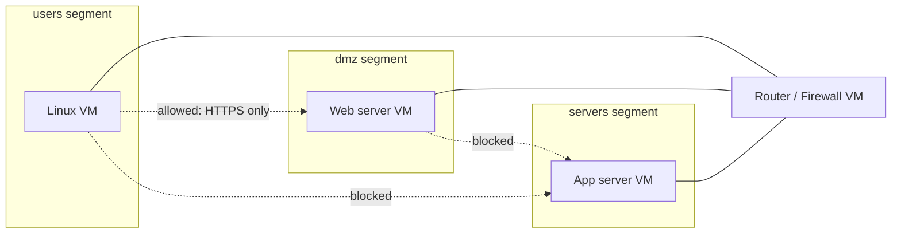

# Day 01 — Home Lab with Segmented Network

> **One-line hook:** I built an isolated, multi-segment virtual network and wrote a tool that proves the isolation works, instead of just assuming it does.

`Level: 🟢 Beginner` · `Stack: VirtualBox/Proxmox, pfSense or Linux routing, Python` · `Maps to: NIST CSF PR.AC-5 (network segmentation)`

---

## 1. The Problem

Ransomware and post-phish lateral movement usually spread because the network
was flat: one compromised laptop could talk to everything else on it.
Segmentation is the control that turns "one machine popped" into "one machine
popped, contained." Before starting anything else in this series, I wanted a
lab that actually enforces that, so later projects (SOC, AD attacks, malware
analysis) have somewhere realistic and safe to run.

## 2. What You'll Learn

- Designing a virtual network with isolated segments (VLANs / internal
  networks), not just "a VM on NAT" — **NIST CSF PR.AC-5**
- The difference between *believing* a network is segmented and *proving* it
  with an actual reachability test
- Writing a safe, read-only network testing tool in Python (subprocess
  hygiene, TCP connect checks, YAML-driven config)
- Documenting a deliberate exception to a "deny by default" policy

## 3. Prerequisites & Lab Setup

1. Install [VirtualBox](https://www.virtualbox.org/) (free) — or Proxmox VE if
   you have spare hardware for a more realistic hypervisor setup.
2. In VirtualBox: **File → Host Network Manager**, create two or more internal
   networks (e.g. `intnet-users`, `intnet-servers`, `intnet-dmz`). Internal
   networks are isolated from each other and your host by default, which is
   what makes this safe to build on a normal laptop.
3. Create a router/firewall VM with one NIC per segment:
   - Easiest: a small Linux VM (Debian/Alpine) with `iptables`/`nftables` doing
     the routing and filtering.
   - More realistic: [pfSense](https://www.pfsense.org/) as the router VM.
4. Create at least one lightweight Linux VM per segment (e.g. Alpine or
   Debian) with a static IP and SSH enabled.
5. Install Python 3.10+ and `pip install -r code/requirements.txt` on each
   segment VM you'll test from.

Nothing in this project needs to run in CI — it's local virtualization work.

## 4. Core Concepts Explained Simply

**Segment** = a network your hypervisor keeps separate at Layer 2/3, the same
idea as a VLAN in a real switch. Think of it like separate rooms in a building
connected only through a reception desk (the router/firewall) that decides who
gets to walk between rooms.

**"Believing" vs "proving" isolation:** it's easy to configure two internal
networks and assume they can't talk. Standing on a host in segment A and
actually trying to reach segment B is a different thing entirely, and it's
the only way to know your firewall rules do what you think they do. The
checker below runs from inside each segment for exactly that reason.



## 5. Step-by-Step Build

See [walkthrough.md](./walkthrough.md) for exact commands. In short:
1. Build the hypervisor network topology (segments + router VM).
2. Deploy a Linux VM per segment, note their IPs.
3. Copy `code/segmentation_check.py` and a filled-in `segments.local.yaml`
   (from `code/segments.example.yaml`) onto one VM per segment.
4. Run the checker from each segment; collect the reports.
5. Save each run's output into `evidence/`.

## 6. The Code, Explained

[`code/segmentation_check.py`](./code/segmentation_check.py) is a small
Python tool with one dependency, PyYAML.

It reads `segments.local.yaml`, which declares which hosts live in which
segment and an explicit `allowed_paths` list: the only traffic that should
legally cross a segment boundary. You run it once per segment, with
`--from-segment <name>`, from a host inside that segment. Reachability only
means something from the vantage point actually behind the firewall rule
being tested; running it from an unrelated machine like your laptop wouldn't
prove anything about the VLAN boundary itself.

For every other segment's hosts, it checks whether a matching `allowed_paths`
entry exists. If one does, it expects a TCP connect on that port to succeed.
If not, it expects even a plain ICMP ping to fail. It prints a PASS/FAIL
table and exits non-zero if reality doesn't match the declared policy, so
it's ready to be dropped into a cron job or CI step later in the series (Day
41's SOC automation, for instance).

`subprocess.run()` always gets an argument list, never a shell string, so a
malformed hostname in the config can't be interpreted as a shell command.

## 7. Results & Evidence

Run from the `users` segment VM:

```
$ python segmentation_check.py segments.local.yaml --from-segment users
Running from segment: users
TO         HOST             EXPECTED       ACTUAL         RESULT
------------------------------------------------------------------
dmz        192.168.30.10    reachable:443  reachable:443  PASS
servers    192.168.20.10    blocked        blocked        PASS
------------------------------------------------------------------
2 checks run, 0 violation(s).

All cross-segment traffic from this segment matches the declared policy.
```

See [`evidence/`](./evidence/) for the real run output and packet captures
from my lab, added once the VMs are built. Screenshots and pcaps aren't
faked ahead of time.

## 8. Detection / Defense Angle

Segmentation is itself a defense, but it needs its own monitoring too.
Firewall and router logs should record and alert on denied cross-segment
attempts; a spike often means a compromised host trying to move laterally,
not a config bug. Periodically re-running `segmentation_check.py`, via cron
or later as a CI/SOAR step, catches configuration drift: someone loosens a
rule for a one-off reason and forgets to revert it.

## 9. Upgrade to Stand Out

The stretch goal from the roadmap: capture traffic during a test run
(Wireshark on the router VM) and include a sanitized `.pcap` in `evidence/`
showing the blocked segment's packets never arriving. Pairs well with Day 04
(packet capture analysis).

## 10. Scope & Legal

This project is for authorized, educational testing only, run against my own
lab / public intentionally-vulnerable targets / my own accounts. Do not use
these techniques against systems you do not own or have permission to test.

## 11. References

- [NIST SP 800-207 — Zero Trust Architecture](https://csrc.nist.gov/pubs/sp/800/207/final) (segmentation as a ZTA building block)
- [NIST CSF](https://www.nist.gov/cyberframework) — PR.AC-5 (network integrity / segmentation)
- [pfSense documentation](https://docs.netgate.com/pfsense/en/latest/)
- [VirtualBox networking modes](https://www.virtualbox.org/manual/ch06.html)

## 12. Interview Prep

1. **Q: Why test segmentation from inside each segment instead of from one central scanner?**
   A: Reachability depends on the vantage point relative to the firewall/VLAN
   rule. A scanner outside the rule's path can only tell you whether it can
   reach the target, which may say nothing about the actual boundary you're
   trying to verify.

2. **Q: What's the difference between "deny by default" and this script's design?**
   A: The script assumes anything not explicitly listed in `allowed_paths`
   should be blocked, and treats a host that's reachable without an explicit
   allow entry as a policy violation rather than a bonus.

3. **Q: Why use both ICMP ping and TCP connect instead of just one?**
   A: ICMP is enough to prove basic network-layer blocking for the "should be
   fully blocked" case. An allowed path needs verifying at the specific port
   it's supposed to work on, since a host could allow ICMP but still block the
   real service port, or the reverse. Testing the actual allowed port is the
   only way to confirm the specific rule.

4. **Q: How would you extend this for a network with 50 segments?**
   A: Keep the same declare-then-verify model, but generate `segments.yaml`
   from the actual firewall/router config instead of hand-writing it, so the
   test can't silently drift from the real rules.

5. **Q: What would make this a false sense of security?**
   A: If the router VM is misconfigured to route between segments by default
   and only pfSense's GUI rules block traffic, an attacker with router-level
   access bypasses the whole model instantly. Segmentation has to be enforced
   at the network layer, not just in application-level rules.
