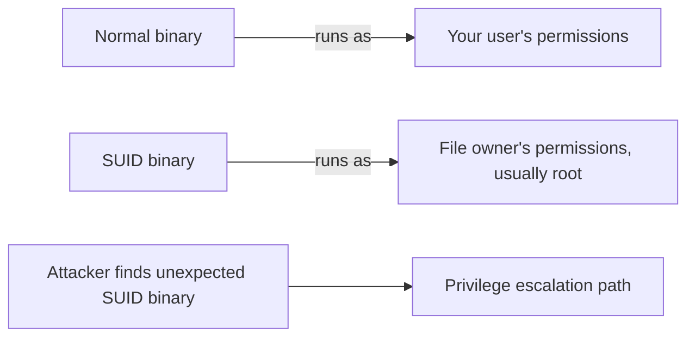

# Day 02 — Linux Fundamentals & CLI Security Toolkit

> **One-line hook:** I wrote a self-contained bash tool that builds a security baseline of any Linux box in one read-only run — the same first move a SOC analyst or sysadmin makes on an unfamiliar host.

`Level: 🟢 Beginner` · `Stack: bash, coreutils, systemd` · `Maps to: NIST CSF ID.AM (asset/config baseline)`

---

## 1. The Problem

You can't recognize something abnormal on a Linux host — a rogue listening
port, an unexpected sudoer, a SUID binary that shouldn't be there — if you've
never systematically looked at what's normal for that specific box. Almost
every security role (SOC, incident response, sysadmin, pentesting) starts
with this same "know your terrain" step, and it's usually done ad hoc,
inconsistently, by hand. This project turns it into one repeatable command.

## 2. What You'll Learn

- The Linux permission model: users, groups, `sudo`/`wheel`, SUID/SGID bits
  — **NIST CSF ID.AM-1/ID.AM-2** (asset & configuration inventory)
- Where services, scheduled tasks, and login history actually live on disk
  (`/etc/passwd`, `/etc/cron.d`, `/var/log/btmp`, systemd unit files)
- Reading and writing defensive bash: `set -uo pipefail`, graceful failure
  instead of silent errors or crashes, root-vs-non-root awareness
- Why "world-writable file" or "SUID binary" is a *lead*, not automatically a
  finding — and why a baseline + diff beats a one-off scan

## 3. Prerequisites & Lab Setup

1. A Linux VM (Kali or Ubuntu) — the `users` segment VM from
   [Day 01](../day-01-home-lab-segmented-network/README.md) works fine.
2. A non-root user with `sudo` access, so you can compare root vs non-root
   output.
3. No extra packages required — see [`code/TOOLS.md`](./code/TOOLS.md) for
   what's used and how the script degrades if something's missing.

Everything here is read-only and safe to run on any box you own.

## 4. Core Concepts Explained Simply

**Users vs. privilege:** every process runs *as* a user, and what that user
can touch is governed by file permissions plus group membership. Being in the
`sudo` (Debian/Kali) or `wheel` (RHEL-family) group is what actually grants
"can become root," not just having an account.

**SUID bit:** normally a program runs with *your* permissions. A SUID
("set user ID") binary runs with the *file owner's* permissions instead —
almost always root. `/usr/bin/passwd` needs this legitimately (to edit
`/etc/shadow`, which regular users can't touch). The risk isn't that SUID
exists — it's a SUID binary with a bug, or one nobody expected to be there.



**Baseline, then diff:** a single recon report tells you what's true *right
now*. Its real value comes from running it again later and diffing the two —
that's how you catch drift (a new listening port, a new sudoer) instead of
just admiring a snapshot.

## 5. Step-by-Step Build

See [walkthrough.md](./walkthrough.md) for exact commands. In short:
1. Copy `code/host_recon.sh` onto the target VM.
2. Run it as a normal user; note which sections say "requires root".
3. Run it again with `sudo`; diff the two outputs.
4. Save both reports into `evidence/`.

## 6. The Code, Explained

[`code/host_recon.sh`](./code/host_recon.sh) walks eight fixed sections —
system identity, users/groups, listening ports, enabled services, SUID/SGID
binaries, world-writable files, scheduled tasks, and login history — and
prints a single readable report.

Two defensive-coding choices worth calling out:
- **`set -uo pipefail` without `-e`.** Several commands here are *expected*
  to fail on some systems (no crontab set, no `wheel` group on Debian). `-e`
  would abort the whole script on the first one; instead `run_or_note()`
  catches the failure and explains it, so the report is always complete.
- **Root-awareness, not root-requirement.** The script checks `id -u` once
  and adjusts what it asks for (e.g. `ss -tulnp` needs root to show process
  names) rather than silently failing or auto-elevating itself with `sudo`
  from inside the script, which would be a surprising thing for a script to
  do on its own.

## 7. Results & Evidence

```
$ ./host_recon.sh | head -20
Host recon report — lab-users-01 — 2026-08-30T09:12:04Z
Run as: kaushik (root: false)

==== System identity ====
Kernel:       Linux 6.1.0-kali9-amd64 x86_64 GNU/Linux
NAME="Kali GNU/Linux"
VERSION="2024.1"
Uptime:       up 2 hours, 14 minutes

==== Users with an interactive shell ====
  root                 uid=0 shell=/bin/bash
  kaushik              uid=1000 shell=/bin/bash
...
```

See [`evidence/`](./evidence/) for full non-root and root reports from my lab
VM, added after running this on the real box.

## 8. Detection / Defense Angle

This *is* a defensive tool, but it also has a defense angle for itself: a
report like this reveals a lot about a box (users, open ports, cron jobs). In
a real environment, running or storing it should follow the same access
control as any other sensitive asset inventory — don't leave `evidence/`
reports somewhere world-readable if the box is anything but a personal lab.

## 9. Upgrade to Stand Out

The roadmap's stretch goal: make it a real recon *tool*, not a one-shot
script — add a `--diff <old-report> <new-report>` mode that highlights new
listening ports, new sudoers, and new SUID binaries between two runs.

## 10. Scope & Legal

This project is for authorized, educational testing only, run against my own
lab / public intentionally-vulnerable targets / my own accounts. Do not use
these techniques against systems you do not own or have permission to test.

## 11. References

- [NIST CSF](https://www.nist.gov/cyberframework) — ID.AM (Asset Management)
- [Linux `sudoers` documentation](https://man7.org/linux/man-pages/man5/sudoers.5.html)
- [GTFOBins](https://gtfobins.github.io/) — how SUID binaries get abused for privilege escalation (read-only reference, not run here)
- [`ss(8)` man page](https://man7.org/linux/man-pages/man8/ss.8.html)

## 12. Interview Prep

1. **Q: Why avoid `set -e` here when it's usually recommended for bash?**
   A: `-e` aborts on the first non-zero exit, but several commands in this
   script (e.g. `crontab -l` with no crontab set) fail *legitimately* and
   shouldn't stop the whole report. `run_or_note()` gets the same safety —
   fail loud, don't fail silent — without killing the script.

2. **Q: Why does a SUID binary matter for security?**
   A: It runs with the file owner's privilege (often root) regardless of who
   invoked it. A bug in a SUID binary — or one that shouldn't be SUID at all
   — is a direct path from a low-privilege shell to root.

3. **Q: The script shows less detail without root. Why not just tell people to always run it as root?**
   A: Running everything as root by default is bad practice and hides useful
   signal — knowing exactly what requires elevation (and documenting that) is
   itself part of understanding the box's privilege boundaries.

4. **Q: How would you turn this one-off report into an ongoing detection?**
   A: Run it on a schedule (cron/systemd timer), store each report, and diff
   consecutive runs — new listening ports, new sudoers, or new SUID binaries
   between two runs are the actual signal, not the raw report itself.

5. **Q: What's a real limitation of this script?**
   A: `find / -xdev ...` only searches the root filesystem's own mount — by
   design, so it doesn't wander into every mounted network share — but that
   means SUID binaries or world-writable files on *other* mounted filesystems
   are invisible to a single run. You'd need to run it once per mount, or
   drop `-xdev` deliberately and accept the longer scan.
