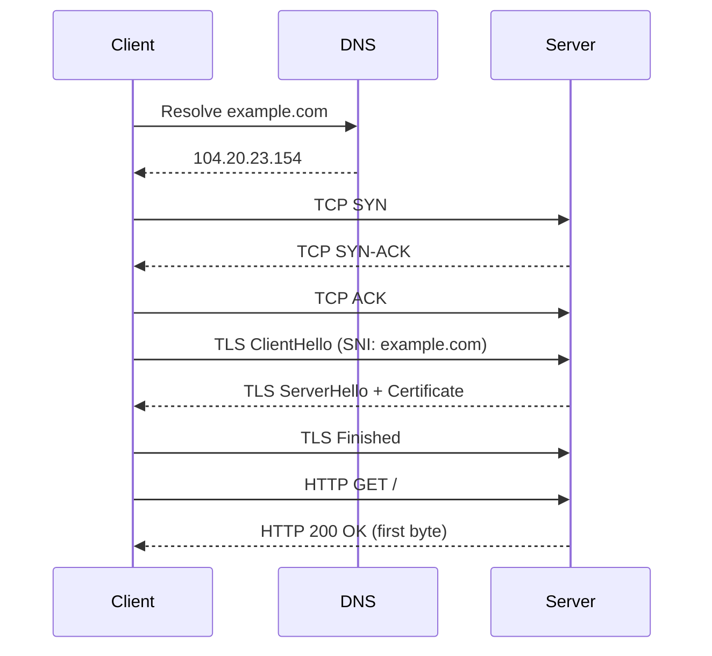

# Day 03 — Networking & Protocols Crash-Project

> **One-line hook:** I built an HTTPS client from raw sockets, no `requests` library, so DNS, TCP, TLS, and HTTP each become something I can time and inspect on their own instead of a black box behind `curl`.

`Level: 🟢 Beginner` · `Stack: Python (stdlib sockets/ssl), Wireshark, dig, curl` · `Maps to: foundational networking (no single ATT&CK/OWASP ID — this underlies all of them)`

---

## 1. The Problem

Every later project in this series, packet analysis, web exploitation, C2
detection, cloud networking, assumes fluency with what's actually happening
on the wire during something as ordinary as loading a webpage. Plenty of
people can run `curl` without being able to say what DNS, the TCP handshake,
or the TLS handshake each contribute to that one request. This project forces
that separation by rebuilding it one layer at a time.

## 2. What You'll Learn

- What DNS resolution actually returns and how long it takes compared to the
  rest of the request
- The TCP three-way handshake as a real, timed network operation, not a
  diagram
- What a TLS handshake negotiates (protocol version, cipher suite) and what
  SNI (Server Name Indication) is for
- Reading a certificate's subject, issuer, and expiry programmatically
- How to read the same request in Wireshark and match it, packet for packet,
  to what the script reports

## 3. Prerequisites & Lab Setup

1. Python 3.10+ — this project uses only the standard library (`socket`,
   `ssl`), no `pip install` required.
2. Wireshark, for the packet-capture side of the walkthrough.
3. `dig` (from the `dnsutils`/`bind9-dnsutils` package on Debian/Kali) and
   `curl`, both usually preinstalled on Kali.
4. Any outbound internet access — this project makes ordinary, single HTTPS
   requests, the same as opening a page in a browser.

Nothing here needs a lab VM specifically; it works on any machine with
internet access, though running it on one of the Day 01 lab VMs keeps
everything in one place.

## 4. Core Concepts Explained Simply

**DNS resolution** turns a name (`example.com`) into an address a computer
can actually route to. It's the first thing that happens and the first place
things can go wrong. The script's DNS-failure test shows this directly:
resolution fails before a single packet aimed at the destination is even
sent.

**TCP three-way handshake** is how two computers agree to open a reliable
connection: SYN, SYN-ACK, ACK. `socket.create_connection()` does this for
you, but the "TCP connect" timing in the report is that handshake. It's not
overhead you can skip.

**TLS handshake** happens on top of the now-open TCP connection and
negotiates which TLS version and cipher suite to use, and proves the
server's identity via its certificate. SNI (Server Name Indication) is the
part of that handshake where the client says which hostname it wants before
anything is encrypted. That's how one IP address ends up hosting HTTPS for
many different domains, each with its own certificate.



## 5. Step-by-Step Build

See [walkthrough.md](./walkthrough.md) for exact commands. In short:
1. Run `dig` and `curl -w` against a target to see the "normal tool" view.
2. Run `code/http_lifecycle_trace.py` against the same target for the
   phase-by-phase breakdown.
3. Capture the same request in Wireshark and match packets to phases.
4. Save the trace output and a `.pcapng` into `evidence/`.

## 6. The Code, Explained

[`code/http_lifecycle_trace.py`](./code/http_lifecycle_trace.py) times four
phases in order: DNS resolution (`socket.getaddrinfo`), TCP connect
(`socket.create_connection`), TLS handshake (`ssl.create_default_context().
wrap_socket`), and time-to-first-byte after sending a hand-built HTTP/1.1 GET
request over the raw socket.

A few choices worth explaining:
- **`ssl.create_default_context()`, not a disabled-verification context.**
  The script uses the system trust store and validates the certificate
  properly. Teaching people to turn off TLS verification as the "normal"
  path would be the wrong lesson.
- **One request per run, `Connection: close`.** This isn't a load-testing or
  scanning tool. Each run makes exactly one HTTP request, matching what a
  single browser page load would do at the network level.
- **Errors are caught per phase** (`socket.gaierror` for DNS, `OSError` for
  TCP, `ssl.SSLError` for TLS), so a failure reports clearly which layer it
  happened at instead of dumping a generic traceback.

## 7. Results & Evidence

```
$ python http_lifecycle_trace.py example.com
Tracing https://example.com:443/

[1] DNS resolution:        94.8 ms -> 104.20.23.154, 172.66.147.243, ...
[2] TCP connect:           34.8 ms -> 104.20.23.154:443
[3] TLS handshake:         39.4 ms -> TLSv1.3, TLS_AES_256_GCM_SHA384
    Certificate subject: example.com
    Certificate issuer:  Cloudflare TLS Issuing ECC CA 3
    Valid until:         Oct 27 22:17:21 2026 GMT
[4] Time to first byte:    66.5 ms -> HTTP/1.1 200 OK

Total (DNS + TCP + TLS + TTFB): 235.5 ms
```

`--no-tls --port 80` skips phase 3 cleanly, and a nonexistent hostname fails
at phase 1 with a clear message instead of a stack trace. curl's own
built-in timing for the same request landed in the same ballpark (`dns:
0.02s connect: 0.05s tls: 0.56s total: 0.58s` on that run), which is a
reasonable sanity check even though curl and this script don't slice the
phases identically. Full output, including what still needs to be redone on
the actual Kali VM with `dig` and Wireshark, is in [`evidence/`](./evidence/).

## 8. Detection / Defense Angle

A defender watching this same traffic would look at DNS queries for
suspicious or newly-registered domains, TLS handshakes where the SNI
hostname doesn't match the certificate's subject (a sign of interception or
misconfiguration), and unusually long TCP-connect times that might point to
network congestion or a rate-limited host. Tools like Zeek build entire
detection pipelines around these same four phases.

## 9. Upgrade to Stand Out

The roadmap's stretch goal: produce a diagram of the full HTTPS request
lifecycle *from your own Wireshark capture* (not the generic mermaid diagram
above), annotated with the actual packet numbers and timestamps for each
phase.

## 10. Scope & Legal

This project is for authorized, educational testing only, run against my own
lab / public intentionally-vulnerable targets / my own accounts. Requests
made here are single, ordinary HTTP(S) requests equivalent to a browser page
load — do not repurpose this tool for scanning or load-testing systems you
don't own or have permission to test.

## 11. References

- [RFC 793 — TCP](https://www.rfc-editor.org/rfc/rfc793)
- [RFC 8446 — TLS 1.3](https://www.rfc-editor.org/rfc/rfc8446)
- [RFC 6066 — TLS SNI extension](https://www.rfc-editor.org/rfc/rfc6066)
- [Python `ssl` module documentation](https://docs.python.org/3/library/ssl.html)
- [Wireshark TLS dissection guide](https://wiki.wireshark.org/TLS)

## 12. Interview Prep

1. **Q: Why measure DNS, TCP, and TLS separately instead of just total request time?**
   A: Each phase fails or slows for a different reason. DNS issues point to
   resolver or domain problems, TCP delays point to network path issues, TLS
   delays point to certificate or negotiation problems. A single total time
   can't tell you which layer to look at.

2. **Q: What is SNI and why does it matter for security?**
   A: It's the hostname the client sends, unencrypted, at the start of the
   TLS handshake so the server knows which certificate to present. Because
   it's unencrypted, a network observer can see which hostname you're
   connecting to even over HTTPS, which is why encrypted SNI (ECH) exists as
   a follow-on standard.

3. **Q: Why use `create_default_context()` instead of disabling certificate verification?**
   A: Disabling verification defeats the point of TLS. It would accept any
   certificate, including one presented by an attacker running a
   machine-in-the-middle attack. The default, verifying context is what any
   production HTTP client should use.

4. **Q: What would you look for in a packet capture to spot a misconfigured or malicious TLS endpoint?**
   A: A certificate subject that doesn't match the SNI hostname requested, an
   unexpectedly old TLS version being negotiated (TLS 1.0 in 2026, say), or a
   self-signed certificate where a public CA-issued one is expected.

5. **Q: This script makes one request per run. How would you adapt it to safely test your own web server's performance under load, without turning it into an unauthorized scanning tool?**
   A: Add an explicit, low, user-set request count and rate limit, run it
   only against hosts you own or have written permission to test, and log
   what was tested. Same authorization boundary as every other project in
   this series.
