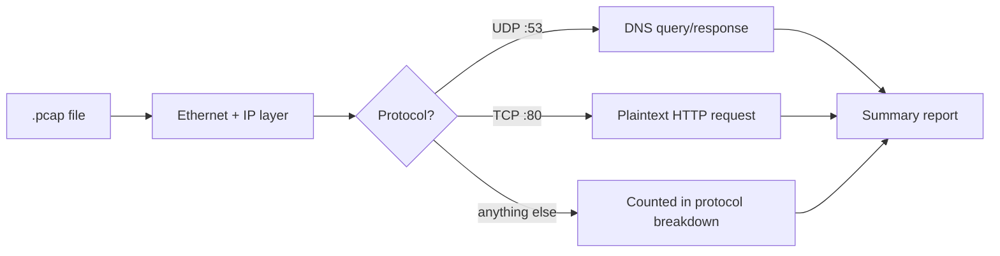

# Day 04 — Packet Capture Analysis Writeup

> **One-line hook:** I wrote a tool that turns a raw .pcap into the same protocol breakdown, top-talkers, and DNS/HTTP summary you'd normally build by hand in Wireshark, then used it to actually read three real captures.

`Level: 🟢 Beginner` · `Stack: Wireshark, Python (dpkt)` · `Maps to: NIST CSF DE.AE (anomaly and event detection foundations)`

---

## 1. The Problem

Running Wireshark and clicking through Statistics menus is a skill, but it's
not the same as being able to say, precisely, what a capture shows: which
hosts talked the most, what DNS names got looked up, whether anything went
out in plaintext that shouldn't have. This project is about producing that
kind of summary reliably, first by hand in Wireshark, then by building a
tool that does the same counting programmatically, which forces actually
understanding what "top talker" or "protocol breakdown" means instead of
trusting a GUI panel.

## 2. What You'll Learn

- Reading a capture's protocol mix, top talkers, and DNS/HTTP traffic in
  Wireshark by hand, then confirming the same numbers programmatically
- What a "top talker" actually is: bytes or packets grouped by source and
  destination, nothing more mysterious than that
- Why DNS queries and plaintext HTTP requests are two of the easiest things
  to extract from a capture, and two of the most useful for spotting
  suspicious activity
- Writing a pcap parser with `dpkt` that fails gracefully on malformed or
  unexpected packets instead of crashing partway through a capture

## 3. Prerequisites & Lab Setup

1. Wireshark, for the hands-on side of the walkthrough.
2. Python 3.10+ and `pip install -r code/requirements.txt` (just `dpkt`).
3. No lab VM needed — this project analyzes existing capture files rather
   than generating live traffic itself.

Sample captures are already in `code/samples/`, sourced from Wireshark's own
public sample/test captures (see `code/samples/SOURCES.md` for exactly where
each one came from).

## 4. Core Concepts Explained Simply

**A .pcap file** is just a sequence of raw packets with timestamps, saved to
disk exactly as they were seen on the wire. Nothing is summarized or
interpreted yet; that's the analyst's job, whether that's you clicking
through Wireshark or a script counting bytes.

**Top talker** means: group packets by (source, destination) and add up
either packet count or byte count. The pair moving the most bytes is the
"top talker" for that capture. It's a completely mechanical calculation —
useful for spotting one host doing something unusual, not a judgment about
whether that's good or bad.

**Why DNS and HTTP get special attention:** DNS queries reveal what a host
was *trying* to reach, even for connections that failed or got blocked
downstream. Plaintext HTTP requests, unlike HTTPS, can be read directly out
of the capture, which makes them one of the easiest ways to spot outdated
software (a device still speaking HTTP where HTTPS should be used) or, in a
malicious capture, exactly what a piece of malware requested.



## 5. Step-by-Step Build

See [walkthrough.md](./walkthrough.md) for exact commands. In short:
1. Open each sample capture in Wireshark and manually note the protocol
   breakdown, top talker, and any DNS/HTTP traffic (Statistics menus).
2. Run `code/pcap_summary.py` against the same capture.
3. Compare the two, they should agree, since the script is doing the same
   counting Wireshark's Statistics panels do internally.
4. Save both the manual notes and the script output into `evidence/`.

## 6. The Code, Explained

[`code/pcap_summary.py`](./code/pcap_summary.py) reads a `.pcap` file with
`dpkt` and, for every IPv4 packet, tallies protocol counts, bytes and
packets per (source, destination) pair, DNS questions (if the packet is UDP
to/from port 53), and plaintext HTTP requests (if the packet is TCP to/from
port 80).

Two choices worth explaining:
- **`dpkt`, not `scapy`.** `dpkt` only ever reads bytes that are already on
  disk — it has no dependency on a live capture driver (Npcap/libpcap). For
  a project that's purely offline analysis, that's the simpler, more honest
  dependency.
- **Failures are caught per packet, not per file.** A single malformed or
  truncated packet (common in real-world captures, less common in these
  clean samples) shouldn't abort the whole analysis. `except
  (dpkt.dpkt.UnpackError, ...)` around each protocol parse means one bad
  packet gets skipped, not the whole report.

## 7. Results & Evidence

Running it against Wireshark's own `dns.cap` sample surfaces a genuinely
varied set of DNS lookups, A, AAAA, MX, PTR, and SRV records, including
Active Directory-style `_ldap._tcp` service lookups:

```
Summary of dns.cap
  Packets:  38
  Duration: 278.879s

Protocol breakdown:
  UDP        38

Top talkers (by bytes, src -> dst):
  192.168.170.20   -> 192.168.170.8       1599 bytes over 14 packets
  ...

DNS queries seen:
  A      www.netbsd.org
  AAAA   www.google.com
  type-33 _ldap._tcp.Default-First-Site-Name._sites.dc._msdcs.utelsystems.local
  ...
```

The `http.pcap` sample, a single packet, still turned up something real: a
plaintext HTTP request to `windowsupdate.microsoft.com`, a good concrete
example of why "plaintext HTTP" was worth watching for even from something
as mundane as an OS update check. Full output for all three samples,
including the fix for a real bug (dpkt returning `str` instead of `bytes`
for DNS names in this version) is in [`evidence/`](./evidence/).

## 8. Detection / Defense Angle

Everything this script extracts maps directly to detection use cases: DNS
query logs are one of the most common data sources for spotting
malware-related domains (the `AAAA www.example.notginh` entry in the dns.cap
sample is exactly the kind of typo/lookalike domain a detection rule would
flag). Plaintext HTTP requests to unexpected hosts are a classic early
indicator in malware traffic analysis. A "top talkers" report run
periodically is a cheap way to catch a host suddenly moving far more data
than its baseline.

## 9. Upgrade to Stand Out

The roadmap's stretch goal: analyze a real malware pcap (from a source like
malware-traffic-analysis.net, handled per that site's safety guidance) and
produce a full incident timeline: first contact, DNS lookups, C2 traffic,
and any data exfiltration, in chronological order with source/destination
attribution.

## 10. Scope & Legal

This project is for authorized, educational testing only. The sample
captures used here are Wireshark's own public sample/test files, not
captured on any network I don't own or have permission to analyze. Any
future malware pcap analysis (see Upgrade to Stand Out) will be handled in
an isolated environment per that source's own safety guidance.

## 11. References

- [Wireshark Sample Captures](https://wiki.wireshark.org/SampleCaptures)
- [dpkt documentation](https://dpkt.readthedocs.io/)
- [RFC 1035 — DNS](https://www.rfc-editor.org/rfc/rfc1035)
- [malware-traffic-analysis.net](https://www.malware-traffic-analysis.net/) — real, safely-shared malicious pcap samples for the stretch goal

## 12. Interview Prep

1. **Q: What's the difference between reading a capture in Wireshark and writing a script to summarize it?**
   A: Wireshark is better for open-ended, interactive investigation, following one conversation, inspecting a single packet's fields. A script is better for a repeatable, comparable summary you can run against many captures or attach to a report, and writing one forces you to understand exactly how each statistic is computed rather than trusting a GUI panel.

2. **Q: Why does the script only handle IPv4?**
   A: Deliberate scope control for a Day 04 project, handling IPv6 correctly means a second parsing path for addresses, headers, and extension headers. Skipping non-IPv4 packets cleanly (rather than crashing on them) is a reasonable, honestly-documented limitation rather than a silent gap.

3. **Q: Why catch parsing errors per packet instead of wrapping the whole file in one try/except?**
   A: Real-world captures often contain a handful of truncated or malformed packets. Catching errors per packet means one bad packet gets skipped and noted, while the other 37 packets in a 38-packet capture still get analyzed, rather than losing the entire report to one bad frame.

4. **Q: What would make a DNS query in a capture suspicious?**
   A: A newly-registered or lookalike domain (like the `www.example.notginh` typo-domain in the sample capture), an unusually high volume of queries to one domain in a short window, or DNS queries with encoded-looking subdomains, a common DNS-tunneling pattern.

5. **Q: How would you extend this script for the malware-pcap stretch goal?**
   A: Add chronological ordering with human-readable timestamps instead of just totals, a way to flag DNS queries against a known-bad domain list, and TLS SNI extraction (the same technique from Day 03) so encrypted C2 traffic still reveals which hostname it connected to.
