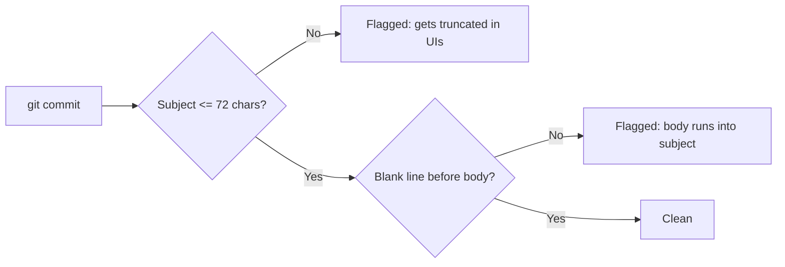

# Day 05 — Git, GitHub & Documentation Discipline

> **One-line hook:** I wrote a tool that audits this actual repo's own documentation structure and commit history against the standard I set on Day 01, and used it to catch two real gaps before they became habits.

`Level: 🟢 Beginner` · `Stack: git, Python (stdlib only)` · `Maps to: no ATT&CK/OWASP ID — this is process discipline, the thing that makes the other 99 days legible`

---

## 1. The Problem

A documentation and commit standard written down once, on Day 01, is easy to
quietly drift from by Day 40: a missing section here, a vague commit message
there, nobody notices because nobody's checking. This project turns "our
standard" into something a script actually verifies, against this repo, not
a hypothetical one.

## 2. What You'll Learn

- Writing clear, useful commit subject lines and knowing why the 50/72-character
  guidance exists (git UIs and `git log --oneline` truncate past it)
- Parsing `git log`'s raw commit message format correctly, `%s`/`%b` looked
  right at first and weren't, which is itself a lesson in checking library
  output instead of assuming it matches the docs
- Structuring markdown documentation so it's checkable, not just readable, by
  keeping section headers consistent enough for a simple script to verify
- Adding badges and a clean top-level README, GitHub's first impression of
  the whole repo

## 3. Prerequisites & Lab Setup

1. This repo, cloned locally, with git history already in place (Days 01-04).
2. Python 3.10+, standard library only, no `pip install` needed for this one.

Nothing here needs a lab VM. It's a Python script and a git repository.

## 4. Core Concepts Explained Simply

**Why commit message discipline matters:** a commit message is a note to
whoever reads the history later, including future-you. `git log --oneline`
truncates long subject lines, and GitHub's commit list does something
similar, so a subject line over roughly 72 characters effectively loses its
ending in the UIs people actually use day to day.

**Why "checkable" documentation beats "readable" documentation:** a README
that's readable but structurally inconsistent (some days have a "Scope &
Legal" section, some call it "Legal & Scope") is fine for a human reading one
file at a time, but impossible to verify at scale. Keeping section headers
exactly consistent means a five-line script can confirm all hundred days
still follow the standard, instead of someone re-reading a hundred files by
hand before a portfolio review.



## 5. Step-by-Step Build

See [walkthrough.md](./walkthrough.md) for exact commands. In short:
1. Run `code/repo_audit.py structure` against the repo root, see what's
   missing.
2. Run `code/repo_audit.py commits` against the repo's own git history.
3. Fix whatever the audit flags, badges on the master README, this day's
   own missing docs, then re-run to confirm.

## 6. The Code, Explained

[`code/repo_audit.py`](./code/repo_audit.py) has two checks. `structure`
walks every `projects/day-NN-*/` folder and confirms `README.md`,
`walkthrough.md`, `notes.md`, a `code/` folder, and an `evidence/` folder all
exist, then checks the README text contains all 12 required section headers
from the project template. `commits` reads the repo's git history and flags
any subject line over 72 characters, any subject ending in a period, and any
commit where the body isn't separated from the subject by a blank line.

The `commits` check went through a real rewrite. The first version used
`git log --pretty=format:%H%x00%s%x00%b`, `%s` for subject and `%b` for
body, on the assumption that the blank-line separator would show up as a
leading `\n` in `%b`. It doesn't: git already strips that separator before
handing back `%b`, so the check fired on every single commit, including ones
that were formatted correctly. Fixed by using `%B`, the full raw message,
and splitting it by hand to actually look at whether line 2 is blank.

## 7. Results & Evidence

Running `structure` against this repo, taken while Day 05 itself was still
missing its own docs, caught exactly that:

```
DAY                                           FILES    DIRS     SECTIONS   RESULT
-------------------------------------------------------------------------------------
day-01-home-lab-segmented-network             3/3      2/2      12/12      PASS
day-02-linux-fundamentals-cli-toolkit         3/3      2/2      12/12      PASS
day-03-networking-protocols-crash-project     3/3      2/2      12/12      PASS
day-04-packet-capture-analysis                3/3      2/2      12/12      PASS
day-05-git-github-documentation-discipline    0/3      2/2      12/12      FAIL
    missing files:    README.md, walkthrough.md, notes.md
-------------------------------------------------------------------------------------
5 project(s) checked, 3 total issue(s).
```

`commits`, after the `%B`-based fix, found all 8 commits in the repo's
history clean:

```
8 commit(s) checked, 0 total issue(s).
```

Full output from both runs, including the pre-fix version showing the false
positives, is in [`evidence/`](./evidence/).

## 8. Detection / Defense Angle

This is a process-hygiene tool rather than a security-detection one, but the
underlying pattern, a script that continuously checks a stated policy
against actual state and reports drift, is exactly the shape of a
configuration-compliance or IaC-policy check (see Day 61, OPA/Checkov). The
skill transfers directly.

## 9. Upgrade to Stand Out

The roadmap's stretch goal, badges and a clean top-level README, is done: the
master `README.md` now has status badges. A further upgrade: wire
`repo_audit.py` into a GitHub Actions workflow so it runs automatically on
every push and fails the build if a new day skips a required file or
section (a preview of Day 58-59's DevSecOps pipeline work).

## 10. Scope & Legal

This project is for authorized, educational testing only, and only inspects
this repo's own files and git history, nothing external.

## 11. References

- [Conventional Commits](https://www.conventionalcommits.org/)
- [git-scm.com — "A note about git commit messages" (tbaggery)](https://tbaggery.com/2008/04/19/a-note-about-git-commit-messages.html)
- [`git log` pretty format documentation](https://git-scm.com/docs/pretty-formats)
- [Shields.io](https://shields.io/) — badge generation used in the master README

## 12. Interview Prep

1. **Q: Why does commit subject length matter at all?**
   A: Most git UIs and `git log --oneline` truncate long subject lines, so
   anything past roughly 72 characters effectively loses its ending for
   anyone skimming history, which is most of the time history actually gets
   read.

2. **Q: What went wrong with the first version of the commit checker, and what does that teach about writing tools like this?**
   A: `%b` looked like the right field for "commit body" but git already
   strips the separating blank line before returning it, so a check that
   assumed that blank line would still be there fired on every commit,
   including correctly-formatted ones. The lesson is to verify a library's
   actual output rather than what the field name implies it should contain.

3. **Q: Why check documentation structure with a script instead of just reviewing it by hand?**
   A: Manual review doesn't scale past a handful of files, and it's
   inconsistent, a reviewer catches different things on different days. A
   mechanical check of "does this file exist, does this header appear" is
   boring but exhaustive, and it's the same kind of check config-compliance
   and IaC-policy tools run in later projects.

4. **Q: This tool is read-only. How would you extend it to actually enforce the standard, not just report on it?**
   A: Wire it into a CI step (GitHub Actions) that runs on every push and
   fails the build on a nonzero exit code, the same pattern as Day 58-59's
   security-gated pipeline, just applied to documentation instead of code
   vulnerabilities.
