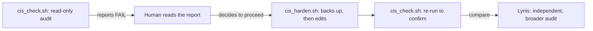

# Day 06 — Linux Hardening Against CIS Benchmark

> **One-line hook:** I wrote a 10-check CIS-mapped auditor and a matching hardener, ran real Lynis for comparison, and got a genuine 6-fail-to-0-fail delta with the hardening index moving from 57 to 59.

`Level: 🟢 Beginner` · `Stack: bash, Lynis, Debian` · `Maps to: CIS Debian/Ubuntu Benchmark, NIST CSF PR.IP-1 (baseline configuration)`

---

## 1. The Problem

A hardening standard like the CIS Benchmark is a document until someone
turns it into actual configuration and can prove the before/after. Reading
the CIS PDF doesn't change a single file on a real system; running the right
`chmod`, editing the right config line, and re-checking is what does.

## 2. What You'll Learn

- What a CIS control actually is at the file level, not the policy level:
  "ensure permissions on /etc/shadow are configured" means `stat` showing
  `0640 root:shadow`, nothing more mysterious
- Why checking and changing a system should never be the same command
  (`cis_check.sh` is read-only, `cis_harden.sh` is the only thing that
  writes, and it backs up every file first)
- How a hand-built 10-check script compares to a real, industry-used tool
  (Lynis) that checks over 200 things
- Reading Lynis' hardening index and knowing it's a relative signal, not a
  pass/fail grade

## 3. Prerequisites & Lab Setup

1. A Debian or Ubuntu VM/container — real hardening needs a real
   distribution's actual config file layout.
2. Root or sudo access (the hardener needs it; the checker doesn't).
3. `lynis` installed (`apt-get install lynis`) for the comparison run.

Run the checker on a real VM you're allowed to modify, not a production
box, `cis_harden.sh` makes real changes.

## 4. Core Concepts Explained Simply

**A CIS Benchmark control** is a specific, checkable configuration
recommendation, not a vague policy statement. "Ensure SSH root login is
disabled" resolves to one line: `PermitRootLogin no` in
`/etc/ssh/sshd_config`. That's what makes it auditable by a script instead
of a human opinion.

**Why "check" and "harden" are separate scripts:** running an audit should
never accidentally change anything, that's the difference between an
observer and an actor. Keeping them separate means you can run `cis_check.sh`
as often as you want, on anything, with zero risk, and only run
`cis_harden.sh` once you've read what it's about to do.

**Hardening index isn't a percentage of controls passed**, Lynis weighs
different checks differently and the score moves nonlinearly. A jump from
57 to 59 after fixing 6 specific things doesn't mean "6 points per fix";
it means Lynis is tracking roughly 229 things total, our 10-check script
covers a small, specific slice of that.



## 5. Step-by-Step Build

See [walkthrough.md](./walkthrough.md) for exact commands. In short:
1. Run `code/cis_check.sh` on a fresh VM/container, read the FAILs.
2. Run `code/cis_harden.sh` (as root), which backs up every file it touches.
3. Run `code/cis_check.sh` again, confirm the FAILs are gone.
4. Run real Lynis before and after, compare its hardening index and
   warnings against what the hand-built script covers.

## 6. The Code, Explained

[`code/cis_check.sh`](./code/cis_check.sh) runs 10 checks mapped to real
CIS Debian/Ubuntu Benchmark controls, file permissions on
`/etc/passwd`/`/etc/shadow`, empty-password accounts, SSH root login and
empty-password settings, password max age and default umask from
`/etc/login.defs`, core dump restriction, IP forwarding, and whether
`auditd` is installed. Every check degrades to `N/A` rather than crashing
when a file doesn't exist (e.g. no SSH installed), the same graceful-failure
pattern from Day 02's `host_recon.sh`.

[`code/cis_harden.sh`](./code/cis_harden.sh) is the only script that writes
anything, and it backs up every file it's about to touch with a
timestamped `.bak.<timestamp>` copy first. It requires root explicitly and
refuses to run without it, rather than silently failing partway through.
The sysctl-based checks (core dumps, IP forwarding) are only fixed at
runtime here, a real deployment would also add them to `/etc/sysctl.d/` so
they survive a reboot, which is called out directly in the script's output
rather than left implicit.

## 7. Results & Evidence

Before hardening, a fresh Debian container passed 4 of 10 checks and failed
the other 6:

```
[5.1 ] SSH root login disabled                       FAIL  not explicitly set to 'no'
[5.2 ] SSH empty passwords disabled                  FAIL  not explicitly set to 'no'
[1.4 ] Password max age <= 365 days                  FAIL  PASS_MAX_DAYS 99999
[1.5 ] Default umask 027 or stricter                 FAIL  UMASK 022
[3.1 ] IP forwarding disabled                        FAIL  value 1
[4.1 ] auditd installed                              FAIL  not installed
4 passed, 6 failed, 0 not applicable.
```

After running `cis_harden.sh`:

```
10 passed, 0 failed, 0 not applicable.
```

Real Lynis, run independently on a fresh baseline container and again after
hardening, showed the hardening index move from **57 to 59**, a small but
genuine change, since our 10 checks are a narrow slice of the roughly 229
things Lynis actually checks (unused kernel modules, password hashing
rounds, PAM configuration, package vulnerabilities, and more). Full output
for both tools, before and after, is in [`evidence/`](./evidence/).

## 8. Detection / Defense Angle

Hardening reduces attack surface before an incident happens, but the
backup files `cis_harden.sh` creates are themselves worth protecting and
monitoring: an attacker who's gained access sometimes reverts hardening
changes using exactly this kind of `.bak` file, so a file-integrity monitor
watching `/etc/ssh/sshd_config` and `/etc/login.defs` for unexpected
changes (Day 34's Sysmon/auditd territory) closes that loop.

## 9. Upgrade to Stand Out

The roadmap's stretch goal: automate this with Ansible instead of a bash
script, and re-audit for the delta. An Ansible playbook with idempotent
tasks (`lineinfile`, `file` module for permissions) covering the same 10
controls would let this run safely and repeatably across a whole fleet
instead of one host at a time.

## 10. Scope & Legal

This project is for authorized, educational testing only, run against my
own lab containers. `cis_harden.sh` makes real configuration changes and
should never be run against a system you don't own or don't have explicit
permission to modify, disabling SSH root login incorrectly, for instance,
can lock you out of a real remote box.

## 11. References

- [CIS Benchmarks](https://www.cisecurity.org/cis-benchmarks) — the official standard this project is scoped from
- [Lynis](https://cisofy.com/lynis/) and [Lynis documentation](https://cisofy.com/documentation/lynis/)
- [Debian `login.defs` manual page](https://manpages.debian.org/bookworm/login/login.defs.5.en.html)
- [`sshd_config` manual page](https://man.openbsd.org/sshd_config)

## 12. Interview Prep

1. **Q: Why are checking and hardening kept as two separate scripts?**
   A: An audit should carry zero risk of changing anything, that's what
   makes it safe to run repeatedly and automatically. Keeping the write
   path in a separate script that requires root and backs up every file
   means someone always makes a deliberate decision before anything
   actually changes.

2. **Q: The hardening index only moved from 57 to 59. Does that mean the hardening didn't work?**
   A: No, it means the 10 controls fixed here are a narrow slice of what
   Lynis checks overall (roughly 229 tests). The `cis_check.sh` before/after
   (6 failures to 0) is the accurate measure of what this specific script
   did; the Lynis score is a broader, independent signal that correctly
   shows there's more hardening work Lynis knows about that this project
   didn't attempt.

3. **Q: Why back up files before editing instead of just relying on git or version control?**
   A: The target system might not have git tracking `/etc`, and a hardening
   script should be self-contained and safe to run on any box, not
   dependent on separate tooling being present. A same-directory `.bak`
   file is the simplest thing that reliably works everywhere.

4. **Q: What's the actual risk in a script like `cis_harden.sh` if run carelessly on a real remote server?**
   A: Setting `PermitRootLogin no` before confirming a working non-root
   sudo account exists can permanently lock out remote access with no
   console fallback, this is exactly the kind of change that should be
   tested on a disposable VM or a console-accessible box first, never a
   remote production server as the first test.

5. **Q: How would you extend this to a fleet of servers instead of one host at a time?**
   A: Convert both scripts' logic into an Ansible playbook with idempotent
   tasks, so running it twice produces the same end state, and use
   `--check` mode as the audit-only equivalent of `cis_check.sh` before
   applying changes fleet-wide.
